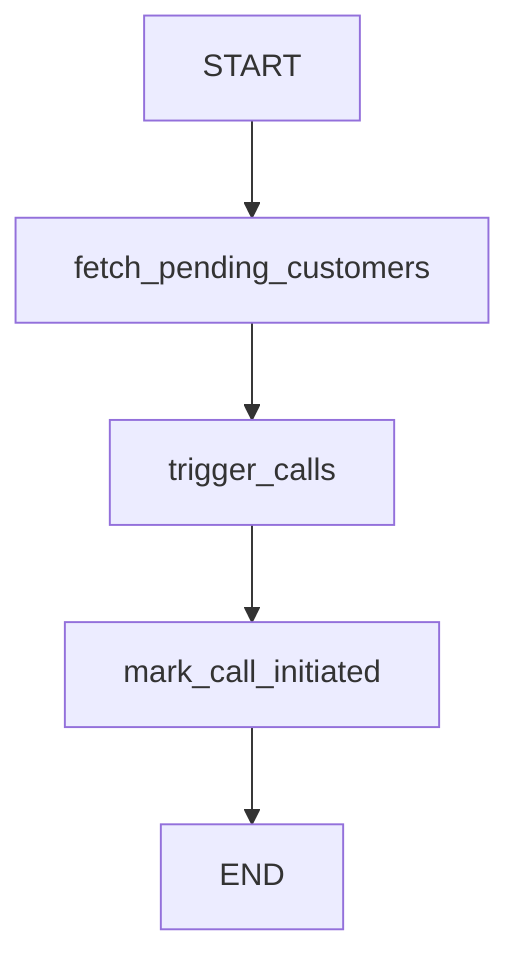
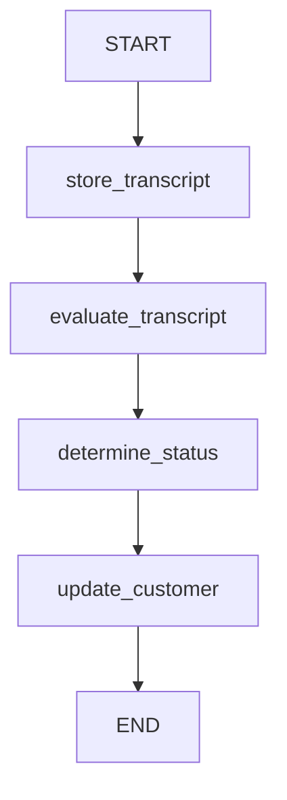

# CallAgent Backend

Multi-tenant agentic voice orchestrator backend built with FastAPI, Supabase, Vapi, LangGraph, and OpenAI.

This backend powers an outbound lead qualification workflow for a React/Next.js dashboard.
It supports tenant/company management, customer/lead tracking, campaign dispatch, webhook ingestion,
call logging, transcript evaluation, and Cloud Run deployment.

## What This Project Does

The system supports the following end-to-end flow:

1. A user selects a company in the dashboard.
2. The backend loads that company’s pending customers.
3. A campaign is started through the API.
4. The dispatch flow builds a per-tenant dynamic prompt.
5. The backend triggers outbound Vapi calls for each pending lead.
6. Vapi sends webhook events back to the backend.
7. The webhook payload is saved to disk as a `.json` file.
8. The webhook processing flow records the call and evaluates the transcript.
9. Customer status is updated automatically.
10. The frontend can poll the APIs to show campaign progress and call outcomes.

## Tech Stack

- FastAPI for HTTP APIs and webhook handling
- Supabase as the primary database
- SQLAlchemy for database access in the application layer
- Vapi for outbound voice calls
- LangGraph for orchestration flows
- OpenAI for transcript classification and reasoning
- Docker for containerized deployment
- Google Cloud Run as the intended production runtime

## Architecture

The backend follows this rule set:

- Routes call services.
- Services call repositories.
- Repositories handle persistence.
- LangGraph is used only for orchestration.
- No business logic should live in route handlers.
- No direct Vapi/OpenAI calls should be made from routes.

### Runtime Layers

- `app/main.py` creates the FastAPI app, mounts routers, configures CORS, request IDs, logging, and startup database initialization.
- `app/config.py` loads all environment variables.
- `app/db.py` creates the SQLAlchemy engine/session and initializes metadata.
- `app/models/` contains Pydantic schemas and SQLAlchemy models.
- `app/routes/` contains API route handlers.
- `app/services/` contains repositories and external API clients.
- `app/graphs/` contains orchestration helpers for dispatch and evaluation.

## Project Structure

```text
backend/
├── app/
│   ├── main.py
│   ├── config.py
│   ├── db.py
│   ├── models/
│   │   ├── __init__.py
│   │   ├── schemas.py
│   │   └── db_models.py
│   ├── routes/
│   │   ├── health.py
│   │   ├── companies.py
│   │   ├── customers.py
│   │   ├── campaigns.py
│   │   └── webhooks.py
│   ├── services/
│   │   ├── repository.py
│   │   └── vapi_client.py
│   └── graphs/
│       ├── state.py
│       ├── dispatch_graph.py
│       └── evaluation_graph.py
├── .env.example
├── requirements.txt
├── Dockerfile
└── README.md
```

## Environment Configuration

All configuration is read from environment variables.

### Supported Variables

- `ENVIRONMENT`
- `LOG_LEVEL`
- `PORT`
- `SUPABASE_URL`
- `SUPABASE_KEY`
- `SUPABASE_SERVICE_ROLE_KEY`
- `TENANT_API_KEY`
- `DATABASE_URL`
- `OPENAI_API_KEY`
- `VAPI_API_KEY`
- `VAPI_ASSISTANT_ID`
- `VAPI_PHONE_NUMBER_ID`
- `VAPI_WEBHOOK_SECRET`
- `VAPI_BASE_URL`

### `.env.example`

Example values are provided in `.env.example` for local development.

Production should use `SUPABASE_SERVICE_ROLE_KEY` and keep the public `SUPABASE_KEY` empty.
The backend enforces this when `ENVIRONMENT` is not `development`.

### Tenant Authentication

If `TENANT_API_KEY` is set, protected API routes require the header:

- `X-Tenant-API-Key: <value>`

This is a lightweight tenant gate for dashboard access. It is intended to be replaced or extended with a full auth system later.

## Database Model

The Supabase database is the source of truth for tenant, lead, and call data.

### Table: `companies`

Tenant-level company records.

Columns:

- `id` UUID primary key, default generated
- `name` TEXT, required
- `prompt_instructions` TEXT, optional
- `assistant_id` TEXT, optional
- `created_at` TIMESTAMPTZ, default `now()`
- `updated_at` TIMESTAMPTZ, default `now()` and updated by trigger

Purpose:

- Stores each tenant/company.
- Holds tenant-specific prompting instructions.
- Optionally stores a tenant-specific Vapi assistant identifier.

### Table: `customers`

Lead/customer records belonging to a company.

Columns:

- `id` UUID primary key, default generated
- `company_id` UUID foreign key to `companies(id)`
- `name` TEXT, required
- `phone` TEXT, required
- `status` TEXT, required
- `created_at` TIMESTAMPTZ, default `now()`
- `updated_at` TIMESTAMPTZ, default `now()` and updated by trigger

Allowed status values:

- `PENDING`
- `CALL_INITIATED`
- `QUALIFIED`
- `NOT_INTERESTED`
- `FAILED`
- `NEEDS_REVIEW`

Purpose:

- Stores outbound leads.
- Tracks lead lifecycle through campaign dispatch and webhook evaluation.

### Table: `call_logs`

Call history and transcript records.

Columns:

- `id` UUID primary key, default generated
- `customer_id` UUID foreign key to `customers(id)`
- `call_id` TEXT, optional
- `transcript` TEXT, optional
- `summary` TEXT, optional
- `outcome` TEXT, optional
- `metadata` JSONB, required, default `{}`
- `created_at` TIMESTAMPTZ, default `now()`

Purpose:

- Stores transcripts and call outcomes.
- Supports evaluation and dashboard display.
- Keeps webhook metadata for debugging and analytics.

### Table: `webhook_events`

Webhook payload archive records.

Columns:

- `id` UUID primary key, default generated
- `event_type` TEXT, required
- `payload` JSONB, required, default `{}`
- `created_at` TIMESTAMPTZ, default `now()`

Purpose:

- Stores the raw Vapi webhook payload on disk and mirrors the event in the database when needed.

### Indexes

The following indexes are required and present:

- `customers(company_id)`
- `customers(status)`
- `call_logs(customer_id)`
- `call_logs(call_id)`

### Row Level Security

The live Supabase project has RLS enabled on:

- `companies`
- `customers`
- `call_logs`
- `webhook_events`

Production access should use the Supabase service-role key from the backend environment.

### Triggers

The schema includes `updated_at` triggers for:

- `companies`
- `customers`

These triggers keep the record update timestamps current.

## Seed Data

The Supabase database is seeded with two tenants and six customers.

### Company 1

- Name: `Dream Homes Realty`
- Prompt instructions: `You help customers buy residential properties and qualify home buyers.`

Customers:

- `John Smith` - `PENDING`
- `Sarah Wilson` - `PENDING`
- `Mike Johnson` - `PENDING`

### Company 2

- Name: `Urban Rentals`
- Prompt instructions: `You help customers rent apartments, offices, and commercial spaces.`

Customers:

- `Emma Brown` - `PENDING`
- `David Lee` - `PENDING`
- `Olivia Clark` - `PENDING`

## API Routes

All public routes are mounted under `/api/v1`.

### Health

- `GET /api/v1/health`
- `GET /api/v1/ready`

Purpose:

- Health checks for local development and Cloud Run.

### Companies

- `GET /api/v1/companies`
- `GET /api/v1/companies/{company_id}`
- `GET /api/v1/companies/{company_id}/customers`

Purpose:

- Returns tenant records for the dashboard tenant selector.

### Customers

- `GET /api/v1/customers`
- `GET /api/v1/customers/{customer_id}`

Purpose:

- Returns a single customer record for the dashboard lead view.

### Campaigns

- `GET /api/v1/campaigns/`
- `POST /api/v1/campaigns/`
- `GET /api/v1/campaigns/{campaign_id}`
- `POST /api/v1/campaigns/{company_id}/start`

Purpose:

- Starts an outbound campaign for a company.
- Fetches pending leads.
- Generates dynamic prompts.
- Triggers outbound Vapi calls.

### Call Logs

- `GET /api/v1/call-logs/{customer_id}`

Purpose:

- Dashboard-facing transcript viewer and call history lookup.

### Webhooks

- `POST /api/v1/webhooks/vapi`

Purpose:

- Receives Vapi webhook events.
- Stores the raw payload.
- Saves a timestamped JSON file on disk.
- Extracts call fields.
- Kicks off background evaluation.

### Campaigns

- `GET /api/v1/campaigns/`
- `POST /api/v1/campaigns/`
- `GET /api/v1/campaigns/{campaign_id}`
- `POST /api/v1/campaigns/{company_id}/start`

Purpose:

- Lists and starts outbound campaigns.
- Uses LangGraph dispatch to process pending customers.
- Applies dynamic prompting per tenant.

## Webhook Behavior

The Vapi webhook endpoint is intentionally non-blocking.

### Request Flow

1. Receive webhook request.
2. Parse JSON payload or raw body.
3. Store the raw payload to a timestamped file under `app/storage/webhooks/`.
4. Extract `call_id`, `transcript`, `summary`, and `customer_id` if available.
5. Schedule background evaluation.
6. Return HTTP `200` immediately.

If `VAPI_WEBHOOK_SECRET` is set, the webhook verifies the request signature before processing.

### Webhook Storage Path

Saved files are written to:

- `backend/app/storage/webhooks/`

Each file is timestamped and contains the raw JSON payload.

## Vapi Integration

The `VapiClient` service is responsible for outbound calls.

### Outbound Call Method

`create_outbound_call(customer, company, dynamic_prompt)`

The payload includes dynamic runtime variables:

- `customer_name`
- `company_name`
- `company_prompt`
- `dynamic_prompt`

The method returns the Vapi `call_id` from the API response.

### Outbound Call Flow

1. Load company and pending customers.
2. Build a company-specific prompt for each customer.
3. Create outbound Vapi calls.
4. Update each customer to `CALL_INITIATED`.
5. Track successes and failures.

## LangGraph Orchestration

LangGraph is used as the orchestration layer, not as a persistence layer.

### Dispatch Graph

File:

- `app/graphs/dispatch_graph.py`

State:

- `company_id: str`
- `pending_customers: list`
- `processed_count: int`
- `errors: list`

Responsibilities:

- Fetch pending customers.
- Build dynamic prompts.
- Trigger outbound calls.
- Mark customers as `CALL_INITIATED`.
- Return a campaign summary.

Current helper functions:

- `build_company_prompt(company, customer)`
- `build_dispatch_graph()`
- `summarize_campaign(state)`

### Dispatch Flow



### Evaluation Graph

File:

- `app/graphs/evaluation_graph.py`

State:

- `customer_id: str`
- `transcript: str`
- `summary: str`
- `outcome: str`
- `confidence: float`
- `status: str`

Responsibilities:

- Build the evaluation prompt.
- Classify the transcript.
- Apply the low-confidence rule.
- Summarize evaluation state.

Current helper functions:

- `build_evaluation_prompt(transcript)`
- `build_evaluation_graph()`
- `apply_low_confidence_rule(result)`
- `summarize_evaluation(state)`

### Evaluation Flow



### Human-in-the-Loop Rule

If transcript evaluation confidence is below `0.70`, the system must set:

- `status = NEEDS_REVIEW`

The backend should never guess when confidence is low.

## OpenAI Evaluation

The evaluation layer is intended to use OpenAI structured outputs with the following JSON shape:

```json
{
	"status": "QUALIFIED | NOT_INTERESTED | FAILED | NEEDS_REVIEW",
	"reason": "string",
	"confidence": 0.0
}
```

Prompt intent:

- Analyze the lead qualification call transcript.
- Decide whether the customer is qualified, not interested, the call failed, or requires review.
- Return structured JSON only.

## Repository Layer

File:

- `app/services/repository.py`

The repository layer is responsible for all database access patterns.

### Current Repository Capabilities

- `get_company(company_id)`
- `list_companies()`
- `get_customer(customer_id)`
- `list_customers()`
- `list_company_customers(company_id)`
- `get_pending_customers(company_id)`
- `update_customer_status(customer_id, status)`
- `create_call_log(payload)`
- `get_call_log(customer_id)`
- `create_company(payload)`
- `create_customer(payload)`

### Repository Hardening

The Supabase repository layer includes:

- Pagination support via `limit` and `offset`
- Upstream error mapping to avoid leaking raw transport errors
- Explicit `not found` handling for missing customer records

### Error Mapping

- `404` for missing resources
- `502` for Supabase upstream failures
- `500` for unexpected repository errors

### Webhook Storage Repository

The webhook route currently saves the raw payload to disk and also creates call logs through the repository layer.

## Frontend-Ready API Contract

The React/Next.js dashboard can use these endpoints for:

- Tenant selector
- Lead directory
- Campaign start button
- Live progress polling
- Call transcript viewer
- Analytics dashboard

Recommended UI data flow:

1. Load companies.
2. Select a company.
3. Load company customers.
4. Start campaign.
5. Poll call logs or company customer status.
6. Open transcript details from call logs.

## Observability

The app includes structured runtime hooks for production operations.

### Current Logging Features

- Python logging configuration in `app/main.py`
- Request ID middleware
- HTTP response `X-Request-ID` header
- Generic exception handling without stack traces exposed to clients

### Expected Observability Fields

- Request IDs
- Campaign IDs
- Company IDs
- Customer IDs
- Vapi call IDs
- LangGraph execution logs
- Webhook processing logs
- Error traces in server logs

## Testing

Pytest coverage exists for:

- repository behavior
- company and customer routes
- dispatch and evaluation graphs
- webhook processing

Run the suite with:

```bash
uv run --python .venv\Scripts\python.exe -m pytest
```

## Cloud Run Verification

The Docker image is Cloud Run ready and reads the runtime `PORT` variable.

Before deploying, verify:

1. `GET /api/v1/health` returns `200`
2. `PORT` is set by the platform
3. `SUPABASE_SERVICE_ROLE_KEY` is configured in production
4. `TENANT_API_KEY` is configured if you want dashboard access control
5. The webhook URL is publicly reachable

Recommended production startup path:

- build the Docker image
- deploy to Cloud Run
- point Vapi at the public `/api/v1/webhooks/vapi` endpoint

## Error Handling

The backend should return proper HTTP status codes and avoid exposing internal exceptions.

### Current Behavior

- `404` when a company is not found
- `404` when a customer is not found
- `400` when a webhook payload does not contain `customer_id`
- `500` for uncaught server errors

### Planned Custom Exceptions

- `CompanyNotFound`
- `CustomerNotFound`
- `VapiError`
- `TranscriptEvaluationError`
- `CampaignDispatchError`

## Cloud Run Readiness

The backend is intended to run on Google Cloud Run.

### Cloud Run Requirements

- Docker-compatible image
- Uses the `PORT` environment variable
- Stateless runtime behavior
- Public webhook endpoint
- Health check endpoint
- Environment-based configuration
- Small production container image

### Docker

Build and run:

```bash
docker build -t callagent-backend .
docker run -p 8000:8000 --env-file .env callagent-backend
```

### Cloud Run Startup

The server should bind to `0.0.0.0` and listen on `PORT`.

## Development Setup

### Local Run

```bash
cd backend
python -m venv .venv
.venv\Scripts\activate
pip install -r requirements.txt
copy .env.example .env
uvicorn app.main:app --reload
```

### Useful Local URLs

- API docs: `http://127.0.0.1:8000/docs`
- Health: `http://127.0.0.1:8000/api/v1/health`
- Vapi webhook: `http://127.0.0.1:8000/api/v1/webhooks/vapi`

### Ngrok Example

For testing Vapi webhooks locally:

```bash
ngrok http 8000
```

Then configure Vapi to call:

- `https://<your-ngrok-domain>/api/v1/webhooks/vapi`

## Testing

The project should be covered with pytest tests for:

- Repository methods
- Campaign routes
- Webhook route
- Dispatch graph
- Evaluation graph
- Transcript classification
- Status updates

## Important Notes

- Supabase is the primary database.
- The source of truth for schema is the Supabase database.
- The project currently stores webhook payloads on disk and call records in the database.
- The webhook route should remain stable even if the public domain changes.
- Tenant-specific prompting must be generated at runtime.

## Current Known Runtime Paths

- `app/storage/webhooks/` stores raw webhook JSON files
- `/api/v1/webhooks/vapi` receives Vapi webhooks
- `/api/v1/campaigns/{company_id}/start` starts outbound campaigns

## Future Work

Recommended next additions:

1. Wire the repository layer directly to Supabase/Postgres models with production-grade async access.
2. Implement real OpenAI structured-output transcript classification.
3. Replace the remaining scaffolded route responses with actual database-backed queries.
4. Add pytest coverage for the new orchestration and webhook flows.
5. Add authentication and tenant authorization for dashboard APIs.
"# AI-Calling-Agent" 
